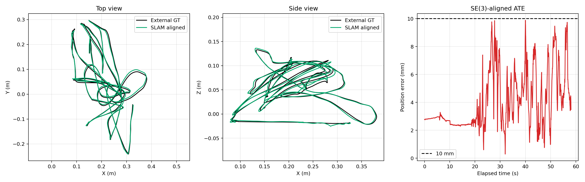
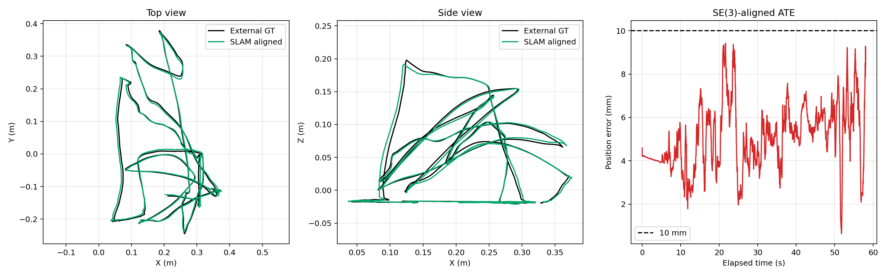

# D405 + STM32 产品 VIO/SLAM

这是客户正式产品分支，只支持 Ubuntu 22.04、ROS 2 Humble、D405 双 IR 和 STM32
63 字节 IMU/编码器联合协议。历史 Jazzy、冻结回环、ORB、旧 VINS 配置和旧标定副本
不在本分支中；需要复现时从历史 Git 标签另建目录。

## UMI SLAM：机载融合与 10 mm 外部真值验证

面向手持式 UMI 轨迹重建，研究版后端只使用机载信息生成轨迹：
D405 双目 IR、400 Hz IMU、VINS/Docker2 相对运动与 MASt3R 视觉几何。
Lighthouse 不参与融合、参数调节或候选选择，只在轨迹冻结后用于外部评分。

已实现的关键链路：

- 对录制输入、标定、时间轴和中间报告做显式质量门控，拒绝来源不一致的候选。
- 并行构建稀疏与密运动关键帧两类候选，以双目/惯性尺度一致性、视觉几何残差和独立机载轨迹分支分歧自动选择或回退。
- 在鲁棒位姿图中结合视觉、双目米制尺度与 IMU 旋转先验，再执行最终输入门控和零相位平滑。
- 候选选择报告强制记录 `external_ground_truth_used=false`，使“运行不看真值、真值只评分”可审计。

### 冻结录制结果

| 录制 | 匹配样本 | ATE RMSE | ATE P95 | ATE Max | 样本 ≤ 10 mm |
| --- | ---: | ---: | ---: | ---: | ---: |
| A | 1,743 | 4.55 mm | 8.33 mm | 9.89 mm | 100% |
| B | 1,743 | 5.29 mm | 7.81 mm | 9.43 mm | 100% |

评测采用 **SE(3) 刚体对齐，不优化尺度**。表中结论仅适用于这两组
冻结录制，不代表所有动作、环境和未见数据都已稳定达到 10 mm。

**录制 A：** RMSE 4.55 mm，P95 8.33 mm，最大误差 9.89 mm。



**录制 B：** RMSE 5.29 mm，P95 7.81 mm，最大误差 9.43 mm。



## 正式组成

- 采集与时间同步：`ego_vio/`、`scripts/capture_d405_720p_rgb_stereo_ir.py`
- 实时VINS：`components/vins_fusion_ros2/`，相机/跟踪30 Hz、估计器后端15 Hz
- 离线30 Hz VINS与自适应回环：`components/vins_fusion_ros2_product_loop/`
- STM32 Mode-B：`firmware/stm32f070_imu_encoder/`
- 设备配置：`config/devices_product_live_stm32.yaml`
- VINS 标定：`config/product_live_stm32/vins_config.yaml`
- 夹爪配置：`config/gripper/umi_manual_gripper_20260824.yaml`

当前 D405 使用出厂双 IR 内参；当前固定装配相机—IMU使用两轮 Kalibr 共识外参和
`td=-0.009312 s`。夹爪状态与 IMU 共用 MCU 计时域，但不参与 VINS/SLAM 优化。

## 安装与构建

```bash
cd /home/robot/ego_vio_humble
./scripts/build_librealsense_rsusb.sh
./build_product_live.sh
```

## 实时产品入口

```bash
cd /home/robot/ego_vio_humble
./run_vins_realtime.sh
```

无参数即为唯一的 `product-live` 模式。任何 `stable`、`frozen`、Jazzy 或候选模式
都会直接拒绝，不会搜索旧 ROS 工作区。

## 录制与离线后处理

```bash
cd /home/robot/ego_vio_humble
./capture_d405_720p_rgb_stereo_ir_rsusb.sh --duration 60
./run_slam_postprocess.sh /绝对路径/录制会话 /绝对路径/输出目录
```

后处理校验离线30 Hz VINS、回环和 DB3 replay 的独立构建哈希，并使用与实时链
相同的产品标定。实时15 Hz和离线30 Hz是两个明确分离的产品产物。
构建、实时和离线入口启动时都会清除终端继承的 ROS/colcon overlay，再只加载
ROS 2 Humble 与本产品签名工作区，避免旧机工作区或 Jazzy 环境污染。
原始录制不提交 Git，应由客户数据盘单独管理。

## 标定与 App 接口

标定脚本、客户逐步手册、夹爪 JSON Schema 和原始标定证据位于独立仓库目录
`/home/robot/ego_vio_calib_kit`，正式版本为
`release/calibration-product-v4-20260824`。标定候选不能直接覆盖本仓库产品配置，必须
经过完整 A/B 和产品门禁。

详细运行边界见 `CURRENT_ACTIVE.md`，代码/配置映射见
`PRODUCT_CODE_MAP_20260824.md`，历史 Git 引用见 `RELEASES_OLD_NEW_20260823.md`。
