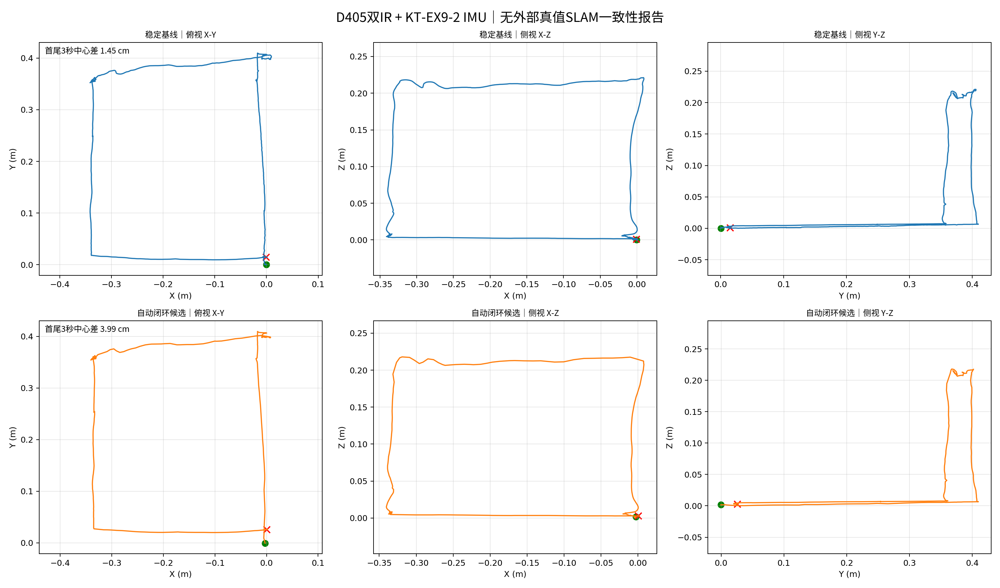

# D405 + KT-EX9-2 SLAM 精度与一致性报告

## 结论

- 本次采集验收：**PASS**。三路相机约30 fps且零缺帧，IMU约400 Hz且正式采集窗口零丢帧。
- 当前稳定基线的首尾3秒驻留中心差为 **1.45 cm**。
- 自动闭环候选版在不知道真实终点的情况下自主接受 1 个闭环，首尾驻留中心差为 **3.99 cm**，相对基线改善 **-175.0%**。
- 本报告没有外部逐点真值，因此上述数值是**闭环一致性/重复定位误差**，不是绝对轨迹误差ATE。当前不能据此宣称“绝对定位精度为3.99 cm”。
- 交付建议：稳定基线可作为当前版本；五帧一致性自动闭环已通过非闭环片段与独立升降数据的误触发检查，仍需扩大重复纹理和开放轨迹样本后再替代稳定基线。

## 测试条件

- 数据会话：`d405_720p_rgb_stereo_ir_20260824_212303`
- 分辨率与频率：1280×720@30 fps，外置IMU 400 Hz
- 视觉输入：D405左/右红外双目；彩色流同步落盘但不进入本次VINS估计
- VIO：VINS-Fusion双目惯性，固定08-08外参与 `td=-0.0117 s`
- 用户提供的唯一验收事实：终点与起点接近但并非完全重合；算法没有接收该事实作为约束

## 采集质量

| 项目 | 结果 |
|---|---:|
| 彩色帧率 / 缺帧 / 重置 | 29.9944 Hz / 0 / 0 |
| 左IR帧率 / 缺帧 / 重置 | 29.9944 Hz / 0 / 0 |
| 右IR帧率 / 缺帧 / 重置 | 29.9944 Hz / 0 / 0 |
| 左右IR设备时间戳差P95 | 0.000 ms |
| 彩色-左IR设备时间戳差P95 | 0.542 ms |
| IMU频率 / 正式窗口丢帧 | 399.9065 Hz / 0 |
| IMU坏帧 / 重同步 / 计数复位 | 0 / 0 / 0 |

## SLAM结果

| 指标 | 稳定基线 | 自动闭环候选 |
|---|---:|---:|
| 输出位姿数 | 1743 | 369 |
| 有效轨迹时长 | 58.08 s | 35.44 s |
| 累计路径长度 | 2.039 m | 1.901 m |
| 首尾3秒驻留中心差 | 1.45 cm | 3.99 cm |
| 水平中心差 | 1.45 cm | 3.99 cm |
| 垂直中心差 | 0.02 cm | 0.15 cm |
| XYZ跨度 | 35.09 / 40.95 / 22.16 cm | 34.83 / 41.01 / 21.77 cm |
| PCA俯视跨度 | 47.91 / 49.30 cm | 46.82 / 46.98 cm |
| 起始驻留RMS | 0.961 mm | 47.725 mm |
| 结束驻留RMS | 0.690 mm | 0.601 mm |

基线首尾中心差XYZ分量：**0.17 / 1.44 / 0.02 cm**。
闭环候选首尾中心差XYZ分量：**0.53 / -3.95 / 0.15 cm**。

## 边界与下一步

1. 当前结果能证明采集完整、估计稳定，并量化“回到相近位置”时的轨迹自洽程度。
2. 因真实终点并非严格重合，首尾中心差同时包含真实放置差和SLAM误差；因此它是保守上界，不等于纯算法误差。
3. 若老板需要“绝对精度”或ATE/RPE，下一轮必须加入可追溯真值：标尺约束的离散停靠点、AprilTag标定场、全站仪或动捕系统。
4. 自动闭环已完成首轮非闭环和升降安全性验证；下一步扩大重复纹理、光照变化和开放轨迹样本，统计误检率后再替代稳定基线。

